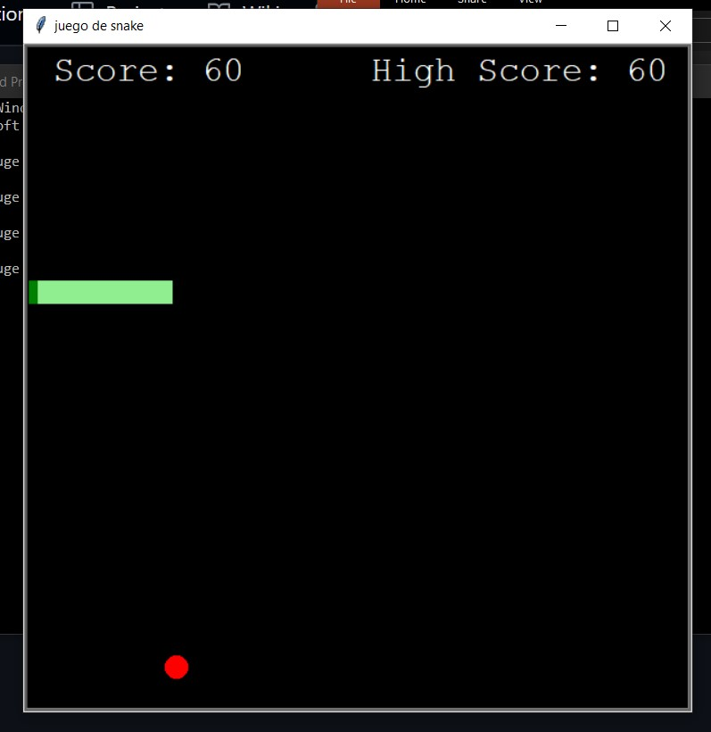

# Proyectos Python
Estos proyectos fueron realizados en mis iniciosn en la programación, antes de ingresar en la facultad.
En el archivo juegoserpiente.py realice uno de mis primeros video juegos con interfaz, este mismo se trata de una copia del conocido videojuego de 1976.

